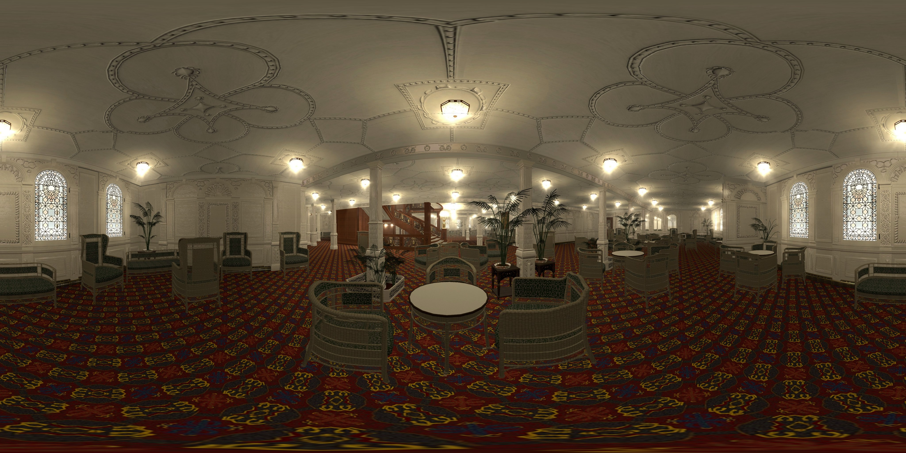

Pannellum
=========

Pannellum is a lightweight, free, and open source panorama viewer for the web. This version provides panorama views without
using iframes.

For more information about usage and compatibility, please visit https://bitbucket.org/mpetroff/pannellum/

All credits goes to mpetroff.

Usage
-----

View index.html for examples.

    <html>
    <head>
    <!-- ... -->
    
    <!-- ... -->
    </head>

    <body>
    <!-- ... -->
    
    <!-- ... -->
    </body>
    </html>

Changes
-------
* Read properties from img - Tag where possible
* Added roation feature
* Refactored pannellum to read properties from object instead uf url
